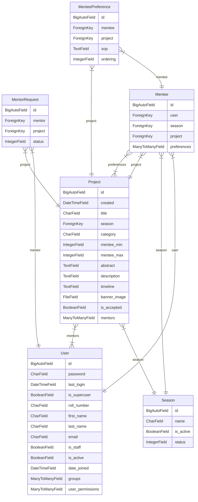

# Database Entity Relationship Diagram
> An entity–relationship model (or ER model) describes interrelated things of interest in a specific domain of knowledge. A basic ER model is composed of entity types (which classify the things of interest) and specifies relationships that can exist between entities (instances of those entity types). -  Wikipedia

This is a diagram that shows the current database schema, generated based on the app's models.

